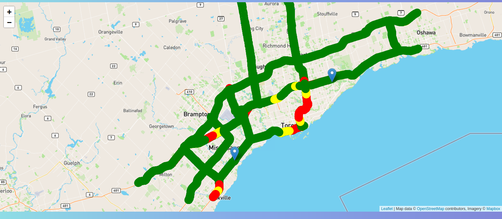
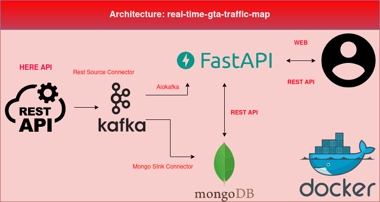

# real-time-gta-traffic-map

**real-time-gta-traffic-map** is an end-to-end data engineering project that provides real time traffic flow and
incident data of major roadways to users via a simplistic web application. It also comes with an API for those who wants
to get their hands dirty and explore the data more.

<!-- TABLE OF CONTENTS -->
## Table of Contents
* [About the Project](#about-the-project)
    * [Architecture diagram](#architecture-diagram)
    * [Built with](#built-with)
* [How it works](#how-it-works)
    * [Data Ingestion](#data-ingestion)
    * [Data Processing](#data-processing)
    * [Data Storage](#data-storage)
    * [Data Visualization](#data-visualization)
* [Getting Started](#getting-started)
  * [Prerequisites](#prerequisites)
  * [Run this project](#run-this-project)
  * [API](#api)
* [Afterword](#afterword)
  * [Reference](#reference)
  * [Contributing](#contributing)    
  * [License](#license)
* [Contact](#contact)  

<!-- ABOUT THE PROJECT -->
## About The Project

Delivering real-time traffic flow data similar to google map, using a mixture of (green, yellow, red)
, with an addition of brown color indicating significant delay. 

On top of that, the app delivers traffic incident data via marker on the map, with incident
context embedded inside the marker.

**Click inside the marker to learn more**

<!-- ARCHITECTURE DIAGRAM -->
### Architecture diagram

### Built With
* [HERE Traffic API](https://developer.here.com/)
* [Apache Kafka](https://kafka.apache.org/)
* [FastAPI](https://fastapi.tiangolo.com/)
* [MongoDB](https://www.mongodb.com/)
* [Docker](https://www.docker.com/)

<!-- HOW IT WORKS -->
## How it works

### Data Ingestion
Our source is HERE API (a REST API). We take advantage of pre-built tools (Kafka Connect) to 
send the data from the API to Kafka (Source Connector). Alternatively, one can design their own kafka producer.
However, this comes with a cost of development (time, debugging, testing). 

Resources used for this stage:
* [Rest Source Connector](https://github.com/llofberg/kafka-connect-rest)

We need to follow the instructions in the README.md to build the jars. I recommend cloning the project to 
your local directory and build it there.

#### Why are we doing this?
This is an external connector and is developed and maintained by the community. You can find most common
connectors in Confluent Hub.
* [Confluent Hub](https://www.confluent.io/hub/)

However, for our case, this is not an option. So, we need to build the jars and put in our application. 
We need to point our plugins to the corresponding directory in the dockerfile (or in docker-compose).

We are getting traffic flow and incident data, so we will need to configure the source connector twice. 
Often times, external connectors will already have documented how to configure their connectors within the 
GitHub page.
* [Like so in source.json](https://github.com/llofberg/kafka-connect-rest/blob/master/examples/spring/config/source.json)

Dissecting what the api does also require decent level of effort as well. You can dig through the documentation
to see what the api does. 
* [Example API call](https://developer.here.com/documentation/examples/rest/traffic/traffic-flow-bounding-box)

When in doubt, I found using jupyter notebook to breakdown the API response to be quite handy. An API call 
can have a size of 10mb, so it will be nearly impossible to tell the structure with naked eye.

### Data Processing
We are using an open-sourced project called Apache Kafka, more specifically Confluent Kafka. This serves as
a buffer between our incoming data and our destination. It strips us the burden to define the data type
of the data beforehand because it will be up to the consumers to do that.

This is also known as the pub/sub system. You can build pipelines with it also. Alternatively, one can use
AWS Kinesis, Google pub/sub and/or Redis.

With Kafka, however, there are a few mandatory resources that you need to bundle with. Namely, zookeeper and
schema-registry.The latter is not a requirement, but is recommended.

With schema registry, we can use Avro serialization. I am not an expert on this topic (My friend google knows
more)

* [Avro Introduction](http://cloudurable.com/blog/avro/index.html)
* [Confluent docs on schema registry](https://docs.confluent.io/platform/current/schema-registry/index.html)
* [Apache Kafka Crash Course - Highly recommended](https://youtu.be/R873BlNVUB4)

So essentially, kafka works as a pub/sub system. You put data on one end (producer/source connector) and
take out on the other end (consumer/sink). The two are independent in the sense that if data is coming in 
very quick, the consumer side can still take their sweet time processing since the data will be stored 
within kafka. With the help of offset, the consumer side will know where to pick up/resume.

It is easy to go down a rabbit hole when learning an unfamiliar technology. My philosophy is to get a working
solution first, and worry about efficiency next. There are always new things to learn in the realm of 
programming.

### Data Storage
NoSQL database seems like a no-brainer to me when you don't have a consistent schema to fit into. When data
is missing, and it is not consistent throughout, NoSQL generally is a good option. Since **MongoDB** is so 
famous, confluent hub does support them. However since I need to build the jars for the previous connector
anyway, I decide to do the same for Mongo Sink Connector as well. 

* [GitHub page for the mongo sink connector](https://github.com/mongodb/mongo-kafka)

You can download the zip, and unzip to get the jar file to put inside the project directory. One can find
more detailed instructions here.

* [Confluent connect install guide](https://docs.confluent.io/home/connect/install.html)

Same as before, looking inside the repo should shed some light on how to configure the connector.

* [MongoDB documentation for kafka-connector](https://docs.mongodb.com/kafka-connector/current/kafka-sink/)

I want to emphasize a few important configurations.

For Kafka:

            KAFKA_PRODUCER_MAX_REQUEST_SIZE: 20970000
            KAFKA_CONSUMER_MAX_PARTITION_FETCH_BYTES: 20970000
            KAFKA_REPLICA_FETCH_MAX_BYTES: 20970000
            KAFKA_MESSAGE_MAX_BYTES: 20970000

For Kafka Connect:

            ENV CONNECT_PRODUCER_MAX_REQUEST_SIZE "20970000"
            ENV CONNECT_CONSUMER_MAX_PARTITION_FETCH_BYTES "20970000"

This needs to be set because there is a default maximum size that Kafka can process. In most cases, this 
should not be a problem. However, if your message size is gigantic, then kafka and kafka connect may fail
to process the message.

### Data Visualization
This is what I consider to be a less relevant, but very important part of the process. It is less relevant
in the sense that, generally data engineer does not have to worry too much about this part. At the same time, 
it is hugely important because without this, most stakeholders will not know what you did.

There are generally three options to choose from in the realm of python developers, that is:
* **Django**
* **Flask**
* **FastAPI** (What I chose)

The reason I decided to pick FastAPI is that it supports asynchronous programming which makes it super-duper
fast.

* [An introduction to asynchronous programming](https://medium.com/velotio-perspectives/an-introduction-to-asynchronous-programming-in-python-af0189a88bbb#:~:text=Asynchronous%20programming%20is%20a%20type,failure%20of%20the%20worker%20thread.)

Also, you can build API on top of it. Alternatively, one can use **Django REST Framework**. 

For visualization, I include a minimalistic **leaflet.js** map that will show the traffic flow and 
incident information. It is set to update automatically every 30s for traffic flow and 120s for traffic incident.

**Why this number?**

Because it takes time to plot points on to the tile map, so I feel like 30s seems optimal. Incident data is
2 minutes because the API updates its information every 2 minute.

* [Leaflet.js](https://leafletjs.com/)

You also need to register for a tile api token key to put on top of your map. I put the free OpenStreetMap
tile just for demonstration. Please adhere to their usage policy.

* [OSMF Usage Policy](https://operations.osmfoundation.org/policies/tiles/)

Mapbox has a generous free usage that allows 200k tile request per month. One can register a free account
and get the token and use it in the javascript code.

* [Mapbox](https://www.mapbox.com/)

I built the front-end logic with JavaScript. JavaScript is actually the first language I learn. I have not
used it for such a long time, and it only serves as a minimal working implementation. Please do not quote 
me on this subject because I am sure there are better practices out there.

One important piece of technology to introduce here is websocket. This allows us to connect our FastAPI and
python backend with our JavaScript frontend, and it works like a charm. We are using aiokafka 
to consume the message and send to frontend via JavaScript.

* [aiokafka docs](https://aiokafka.readthedocs.io/en/stable/)

<!-- GETTING STARTED -->
## Getting Started

### Prerequisites
Technically, you just need docker and docker-compose because we will install all the required images inside
a docker environment.
* [Docker](https://docs.docker.com/get-docker/)
* [docker-compose](https://docs.docker.com/compose/install/)
* [Jars for external source connector](https://github.com/llofberg/kafka-connect-rest)
* [Jars for mongo sink connector](https://github.com/mongodb/mongo-kafka)  
* [Here Traffic API Key](https://developer.here.com/documentation/traffic/dev_guide/topics/credentials-auth-options.html)
* Optional: Your map tile token (via Mapbox)

### Run this project
First, clone this project to your local directory. Change directory (cd) to where you want to put this 
project. For example:
    
    cd ~/Documents

Then run this

    git clone https://github.com/GeekyQuant/real-time-gta-traffic-map.git

Change directory to inside the project directory

    cd real-time-gta-traffic-map

Change the permission of the .sh file to make it executable

    chmod +x run_project.sh

Before you can run this project, you need to go inside connect/config/traffic_flow_source.sh and
put your API key on this line

    "rest.source.url": "https://traffic.ls.hereapi.com/traffic/6.2/flow.json?apiKey=${YOUR_API_KEY}&bbox=43.47653,-79.931948;44.048999,-79.010904&

Simply replace **${YOUR_API_KEY}** with your **actual key**. And similarly for connect/config/traffic_incident_source.sh

You will also need to place your jar files (rest source & mongo sink) inside **connect/jars**. Make
a directory named **jars** under **/connect**.

There are 3 arguments available for this .sh file.
* **up** (Build project infrastructure)
* **stop** (Stop project infrastructure)
* **down** (Remove project infrastructure)

The up mode uses BuildKit in docker that retrieves the cached information.
So build time will be faster. Also, FastAPI will not be run in detached mode, so you can see what changes 
the program makes in real-time.

* Build project infrastructure
    

    ./run_project.sh up

* Stop project infrastructure

    ./run_project.sh stop

* Remove project infrastructure

    ./run_project.sh down

**How to access the web UI**

(Only works if you are running the project)

Go to [localhost:8080/](localhost:8080/) to see the web UI. 

Go to [localhost:8083/connectors](localhost:8083/) to see a list of active connectors

### API
For demo purpose, I only include the API for the traffic incident data. You will know soon that the traffic flow data
is way more messy and harder to work with. This means it is also harder to come up with logic to query the data.

Example searches:

* Get the latest incident information 
  

    localhost:8080/incident/latest
  
* Get all incident information

    localhost:8080/incident

Only 10 records will be shown per page. To see the next 10 results, use pagination. That is

    localhost:8080/incident/?skip=10

It won't make much sense to grab all the incident record, but it is in there. More often, users would want to query for
traffic data within a specific time frame.

If you want to get all the incident data from June 17th 09:00 a.m. to 12:00 p.m., you can use the **YYYY/MM/DD/HH/MM** format.

Do note that when you query for the time, the timezone is in UTC. You do need to convert from EST to UTC if you want 
to use my project. **UTC is 4 hours ahead of EST**.

With that in mind, the logic would be:

    localhost:8080/incident/202106171300/202106171600

We use 24-hour clock and 9 a.m. in EST is 1 p.m. in UTC and so on.

**Note: since not every minute is going to have incidents, the api may return null depending on your query parameter.**

<!-- AFTERWORD -->
## Afterword
This is my first and ever data engineering project, and I have learnt so much. While this may not be the de-facto end-to-end
project, given my understanding of the field, it does cover most grounds. 

This project took me about a month to finish. (I got sidetracked by my other projects and life for some time). I call those
period **coding fatigue**. Looking back, here is my breakdown of time spent:

* **Finding a data source and getting to know the data (~ 5 to 7 days)**
* **Learning how to use the technology (~ 5 days spread across)**
* **Actual coding (~ 7 days spread across)**  
* **Debugging (~ 10 days spread across)**
* **Trying to build a fancy web UI, got wrecked by CSS (~ 7 days) -> Work in Progress**

The last part is still a work in progress. I intend to put this project on my portfolio website. But, I want to quickly
wrap up this project as it has been going for too long.

For those who don't want to spend the time on building this project, I am sorry that you may have to wait for a bit longer
for me to upload my website. Then, you can see how this works in action.

**Challenge Faced**

* Getting docker and docker-compose to work as expected
* Getting kafka to work
* Getting websocket to work

### References
Where I got my ideas, inspirations and references:
1. [damian.klis: He is awesome](https://github.com/damklis/DataEngineeringProject/blob/master/README.md#prerequisites)
2. [iwpnd: I found out about his work towards the end](https://iwpnd.pw/articles/2020-03/apache-kafka-fastapi-geostream)
3. stackoverflow (too many, can't remember)

### Contributing
If you have any thoughts you want to share with me, feel free to contribute. I welcome 
any suggestions, and I strive from critical opinions. 
1. Fork the project
2. Create your Feature Branch (`git checkout -b feature/YourFeature`)
3. Commit your Changes (`git commit -m 'added something awesome'`)
4. Push to the Branch (`git push origin feature/YourFeature`)
5. Open a Pull Request

### License
Distributed under the MIT License. See [LICENSE](LICENSE) for more information.

<!-- CONTACT -->
## Contact
My social media is still under renovation. Please allow me some time to fix it.
[Eric Leung's Linkedin](www.linkedin.com/in/eric-leungth)

Meanwhile, you can reach me via email 
[Eric Leung's email](eric.leungth@gmail.com)